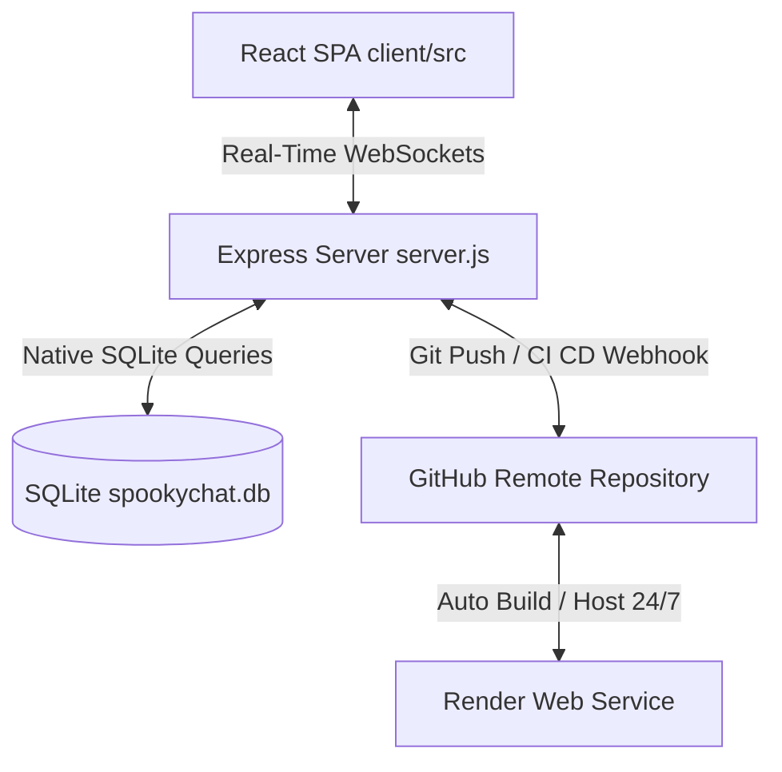
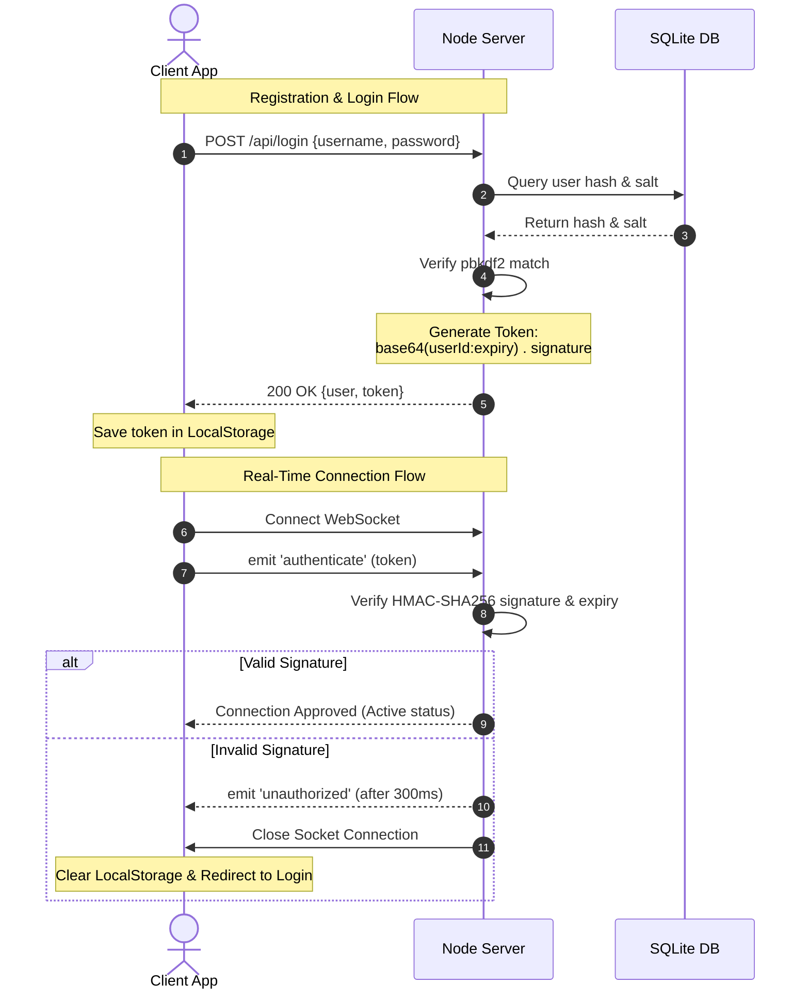
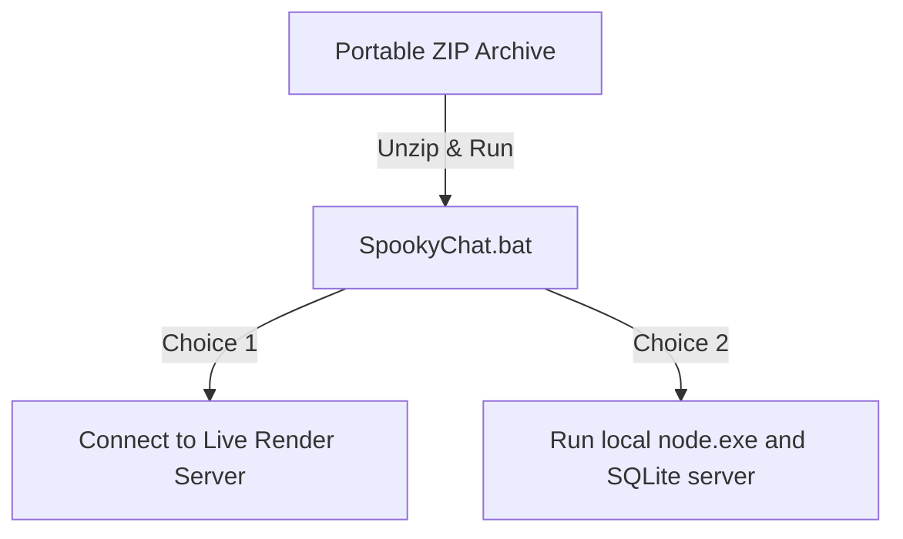

# SpookyChat: Technical Architecture, Deployment & Security Manual


Welcome to the **SpookyChat Technical Architecture & Security Manual**. SpookyChat is a state-of-the-art, secure real-time messaging application designed to demonstrate and simulate **Quantum Cryptography (QKD)** concepts. It models the **E91 Bell State Entanglement Protocol** for 1-on-1 chats and the **GHZ State Entanglement Protocol** for multi-party group conversations.

This document provides a deep, granular walkthrough of the entire system, its data flows, database engine, git version control, 24/7 Render cloud deployment, and portable offline distribution mechanisms.

---

## 1. System Architecture Overview

SpookyChat is engineered as a modern, real-time client-server web application. Below is a high-level flowchart detailing how the components interact:



### Main Modules:
1. **Frontend Client**: Built with **React** and compiled via **Vite** into optimized static web assets. It communicates with the backend via REST endpoints for credentials, and Socket.io for duplex message streaming and telemetry updates.
2. **Backend Server**: Express application running inside a Node.js process that handles HTTP routing, session signature verification, and Socket.io event broadcasting.
3. **Database Engine**: Uses Node's native built-in `node:sqlite` database runner to persist data locally inside a relational SQL file (`spookychat.db`).

---

## 2. Relational Database Specifications

All data is stored and managed using normalized relational tables inside `spookychat.db`. This replaces legacy JSON flat-file storage, ensuring transactional safety, unique indexing, and automated cascading deletes.

```mermaid
erDiagram
    USERS {
        TEXT id PK
        TEXT username UNIQUE
        TEXT salt
        TEXT password_hash
        TEXT quantum_profile
        TEXT created_at
    }
    CHATS {
        TEXT id PK
        INTEGER is_group
        TEXT group_name
        TEXT created_at
    }
    CHAT_PARTICIPANTS {
        TEXT chat_id PK, FK
        TEXT user_id PK, FK
    }
    MESSAGES {
        TEXT id PK
        TEXT chat_id FK
        TEXT sender_id FK
        TEXT recipient_id
        TEXT encrypted_payload
        TEXT quantum_details
        TEXT timestamp
    }

    USERS ||--o{ CHAT_PARTICIPANTS : participates
    CHATS ||--o{ CHAT_PARTICIPANTS : contains
    CHATS ||--o{ MESSAGES : records
    USERS ||--o{ MESSAGES : sends
```

### Relational Schema Definitions:
* **`users`**: Stores user profiles. Passwords are hashed using the pbkdf2 algorithm combined with unique randomly generated salts.
* **`chats`**: Tracks messaging channels. It stores both 1-on-1 channels and group chats.
* **`chat_participants`**: A junction table mapping users to chat channels, enabling flexible many-to-many indexing.
* **`messages`**: Stores message entries. The `encrypted_payload` (ciphertext) and `quantum_details` (telemetry, basis negotiations, and measurement logs) are stored as JSON strings.

---

## 3. Persistent Cryptographic Token Security

To prevent session hijacking and credentials spoofing, SpookyChat implements a native, zero-dependency session token signature system using Node.js's built-in `crypto` module.



### Token Anatomy:
The session token is structured as a two-part period-delimited string:
$$\text{Token} = \text{Base64Url}(\text{userId} : \text{expiry}) \mathbin{\Vert} \text{"."} \mathbin{\Vert} \text{Signature}$$
* **Signature**: Generated using HMAC-SHA256 of the payload, signed with a cryptographically secure server secret key:
  $$\text{Signature} = \text{HMAC-SHA256}(\text{payload}, \text{SERVER\_SECRET})$$
* **Database-Persisted Secret**: The server's `SERVER_SECRET` is saved in the SQLite `settings` table on the first startup. This ensures session tokens survive server reboots and avoids forcing users to log back in when the server restarts.
* **Unauthorized Flush Buffer**: If a token validation fails, the server sends an `unauthorized` event to the client and delays socket disconnection by `300ms`. This ensures the network buffers are flushed, letting the client log out and clear the stale token safely.

---

## 4. Quantum Cryptography (QKD) Engine

The heart of SpookyChat is its simulated QKD engine, modeling how quantum entanglement guarantees secure messaging channels.


### 1-on-1 Chat: E91 Protocol Simulation
For 1-on-1 conversations, SpookyChat models the E91 protocol using an array of 8 entangled qubits:
1. **Bell State Generation**: Qubits are initialized in the Bell singlet state:
   $$|\psi^+\rangle = \frac{1}{\sqrt{2}}(|00\rangle + |11\rangle)$$
2. **Basis Selection**: For each qubit, Alice (the sender) chooses a random measurement basis (Rectilinear $[+]$ or Diagonal $[x]$).
3. **Qubit Measurement**:
   * In the $[+]$ basis: Qubits align to $|0\rangle$ or $|1\rangle$.
   * In the $[x]$ basis: Qubits align to $|+\rangle$ or $|-\rangle$.
4. **Key Derivation**: If Bob (the receiver) measures the qubit using the matching basis, his measurement will be 100% correlated with Alice's. The combined measurements form the 8-bit XOR decryption key.
5. **Eavesdropping (Eve's Probe)**:
   * When the Eavesdropper is toggled, Eve intercepts the qubits in transit and measures them in a random basis.
   * If Eve's basis differs from Alice's, the wave function collapses onto Eve's basis.
   * When Bob subsequently measures the qubit, the entanglement has collapsed, resulting in a $50\%$ chance of a key-bit mismatch. The decryption fails, rendering the message scrambled, and a **Quantum Security Alert** is flagged.

### Group Chat: GHZ State Entanglement
For group conversations, SpookyChat entangles participants in a multi-party **Greenberger-Horne-Zeilinger (GHZ)** state:
$$|\text{GHZ}\rangle = \frac{1}{\sqrt{2}}(|00...0\rangle + |11...1\rangle)$$
When a message is broadcast, the sender collapses the shared state globally. Because of the quantum entanglement, all valid group members measure matching key states simultaneously, facilitating secure multi-party decryption.

---

## 5. Visual Bloch Sphere Telemetry


The application features a 3D Bloch Sphere visualizer inside the collapsible Quantum Core Monitor panel. The Bloch Sphere represents the state vector of the active qubit:
$$| \psi \rangle = \cos\left(\frac{\theta}{2}\right)|0\rangle + e^{i\phi}\sin\left(\frac{\theta}{2}\right)|1\rangle$$
* **Precession**: When idle, the state vector precesses continuously around the Z-axis ($\phi$ changes, representing phase shift), illustrating coherent superposition.
* **Measurement / Collapse**: When a message is transmitted, the state vector collapses instantly to either $|0\rangle$ (North Pole) or $|1\rangle$ (South Pole), visually mapping the wave function collapse.

---

## 6. GitHub Version Control Configuration

The SpookyChat codebase is tracked and synchronized using a remote Git repository hosted on GitHub.

* **GitHub Repository URL**: `https://github.com/srisheshasai/qubit_SpookyChat.git`
* **Default Branch**: `main`

### Repository Ignore Rules (`.gitignore`):
To prevent committing massive build folders, compiled binaries, and private test databases, the repository is guarded by a strict root `.gitignore`:
```text
# Node.js dependencies
node_modules/

# Staging and portable packages
spookychat-portable/
spookychat-portable.zip
spookychat-render-portable/
spookychat-render-portable.zip

# SQLite databases and backups
*.db
*.db-journal
*.db-wal
spookychat.db
database.json.bak

# Client environment build output
client/dist/
client/node_modules/
```

---

## 7. Render Cloud Hosting & Deployment Pipeline

To remain active online 24/7 even when your personal computer is turned off, SpookyChat is deployed on **Render** (linked directly to the GitHub repository).

```mermaid
graph LR
    Push[git push origin main] --> GH[GitHub Repo]
    GH -->|Webhook Trigger| Render[Render Build Container]
    Render -->|npm install| RootDeps[Backend node_modules]
    RootDeps -->|npm run build| ClientBuild[Client assets compile]
    ClientBuild -->|Web Service Boot| ServerStart[node server.js]
    ServerStart -->|Deploy Live HTTPS| LiveURL[https://qubit-spookychat.onrender.com]
```



### 1. Environment & Runtime Specifications
* **Node.js Engines Directive**: The project mandates a minimum Node version of `v22.5.0` inside `package.json` to ensure the cloud container supports the native experimental SQLite compiler `DatabaseSync`.
* **WEB_CONCURRENCY**: Set automatically by Render's virtual CPUs to load balance cluster processes.

### 2. Zero-Config Build Pipeline
The root `package.json` contains a nested compilation chain:
```json
"scripts": {
  "start": "node server.js",
  "client:install": "npm install --prefix client",
  "client:build": "npm run build --prefix client",
  "build": "npm install && npm run client:install && npm run client:build"
}
```
When Render triggers a build, it calls `npm run build`, which:
1. Installs root backend dependencies (`express`, `socket.io`).
2. Installs client frontend dependencies (`react`, `vite`, `qrcode`).
3. Compiles the React assets into `client/dist/` using Vite.

### 3. Filesystem Persistence & Data Migrations
* **Render Free Disk Ephemerality**: Render's free tier filesystems are read-write but reset on restarts. To maintain a permanent database of user registrations, the database can be converted to an external PostgreSQL database (e.g. Neon or Supabase) or hosted on Railway with a persistent disk volume.

---

## 8. Dual Desktop Launchers & Portable Packages

We maintain two distribution configurations to suit different network and testing requirements:



### 1. Host Launcher Script ([host_launch.bat](file:///d:/programs/Qubit_communication/host_launch.bat))
Runs on the developer's laptop. It skips the local server execution entirely and immediately opens Chrome or Edge in standalone `--app` widget mode pointing to:
`https://qubit-spookychat.onrender.com`

### 2. Offline Server/Client Bundle ([spookychat-portable.zip](file:///d:/programs/Qubit_communication/spookychat-portable.zip) - 36 MB)
Contains the full Node executable (`bin/node.exe`), all production backend dependencies (`node_modules`), client assets (`client/dist`), and a local SQLite database (`spookychat.db`).
* **Launcher Choice**: The launcher prompt asks others whether they want to:
  * **Option 1**: Connect to your live Render server (`https://qubit-spookychat.onrender.com`) to chat directly.
  * **Option 2**: Run a private, isolated local server on their own machine (`http://localhost:5000`).

### 3. Live Client-Only Package ([spookychat-render-portable.zip](file:///d:/programs/Qubit_communication/spookychat-render-portable.zip) - 1.2 KB)
An ultra-lightweight client-only wrapper for others. It doesn't contain a Node binary or database, and directly launches their Chrome/Edge browser in app mode pointing to your live Render website.

---

## 10. Progressive Web App (PWA) Specifications

SpookyChat is fully compliant with **Progressive Web App (PWA)** specifications, allowing it to function as a regular website in any browser, while remaining installable as a standalone application on any PC, tablet, or smartphone.

### PWA Components:
1. **Web App Manifest (`manifest.json`)**:
   - Defines the metadata including the app name, background theme colors, and paths to the high-resolution blue star sparkle icon.
   - Enforces `display: "standalone"`, forcing the OS shell to open the web portal in a borderless window mode with its own launcher shortcut.
2. **Service Worker (`sw.js`)**:
   - Manages resource caching and fetch interceptions.
   - Utilizes a Cache-First with Network Fallback strategy to load assets instantly, complying with installability specifications.
